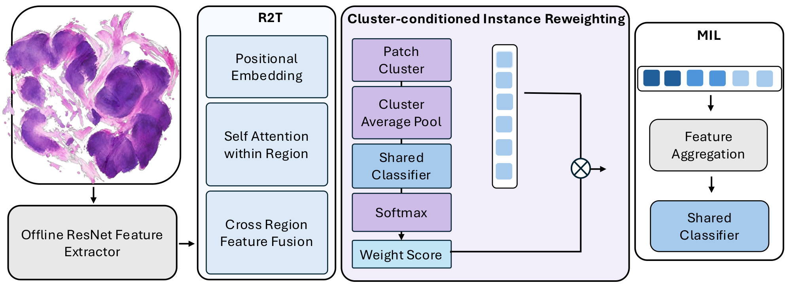

# R²TC-MIL: Weakly Supervised WSI Classification with Cluster-Conditioned Instance Reweighting

## Introduction

R²T-MIL restores spatial context among patches/regions, yet sparse disease evidence can still be diluted in bag pooling. Clustering is already common in MIL (usually for **sampling, selection, or prototype pooling**). R²TC-MIL instead uses a lightweight **Cluster-Conditioned Instance Reweighting (CIR)** step: unsupervised bag-wise clustering + shared-head cluster scoring produces **soft instance weights** that modulate aggregation—**reweighting importance, not selecting/dropping patches**—so high-risk groups can be up-weighted under slide-level labels. On **SLN-Breast**, this improves over the R²T backbone under the same features and splits.

## Experiment
### Dataset & splits

We evaluate on **SLN-Breast** (slide-level binary labels). Each raw whole-slide image is at **gigapixel scale** (on the order of **10^9 pixels** at native resolution), which makes direct end-to-end processing computationally prohibitive.

All MIL methods use the **same 5-fold** slide partitions as the ResNet50 (`resnet/resnet50/splits`, `seed=42`), copied into `model/_common/splits` **without reshuffling**.

Each fold uses a stratified **train / val / test ≈ 60% / 20% / 20%** split (≈78 / 26 / 26 slides), keeping class ratios close to the overall positive/negative balance. Model selection uses **first-best validation AUC** (ties keep the earliest epoch); **test ACC / AUC** are reported only for that checkpoint, then averaged over 5 folds (mean ± std).

MIL methods share frozen **ImageNet ResNet50-trunc (1024-d)** patch features. The ResNet50 row is a **slide-level** baseline (WSI resized to 256×256), not MIL.

### Results

| Method                 | ACC               | AUC               |
| ---------------------- | ----------------- | ----------------- |
| ResNet50 (slide-level) | 0.777 ± 0.088     | 0.801 ± 0.149     |
| DSMIL                  | 0.723 ± 0.015     | 0.693 ± 0.077     |
| ABMIL                  | 0.846 ± 0.084     | 0.843 ± 0.174     |
| R2T-MIL                | 0.846 ± 0.042     | 0.893 ± 0.056     |
| **R2TC-MIL (ours)**    | **0.885 ± 0.024** | **0.923 ± 0.039** |

5-fold test metrics at first-best val AUC.